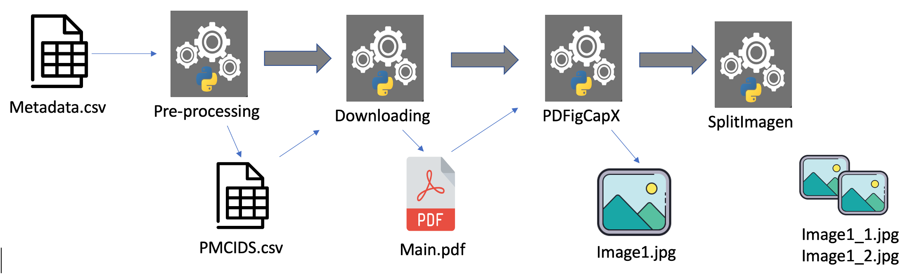

# Curation pipeline for CORD19 - Allen Institute
-------------

This version of the Curation pipeline takes as input the metadata provided in [CORD19](https://ai2-semanticscholar-cord-19.s3-us-west-2.amazonaws.com/historical_releases.html) by  [Allen Institue for AI](https://www.semanticscholar.org/paper/CORD-19%3A-The-Covid-19-Open-Research-Dataset-Wang-Lo/4a10dffca6dcce9c570cb75aa4d76522c34a2fd4)


## Directory structure
+ **input**: In case you are provided with a set of papers to filter out, e.g. list of cords ids, you can copy it here so the next steps can take into account.
+ **log**: All generated log and tracker files to support the pipeline 
+ **output**: For resulting generated files that different stages will create.
+ **src**: Python souce code  
    + **(default)**: Main Wrappers for Download, PDF 
    + **image_extraction**: Core funcionality of the cord19 data processing
        + **init.config**: The configuration file containing all the global variables that will be used through the pipeline. e.g. home_directory, number_processors, tracker_file_path, etc
    + **test**: Different test scenarios using the Wrappers. e.g. one directory, from a file, parallel processes, etc


## Pipeline stages
------------------------
The pipeline consists of a series of modules developed in Python to extract image and text data (image captions) throughout different stages by using and generating input/output files 

 

#### Stage 0: Preprocessing 

Here we can contemplate two main scenarios:
1. **Metadata as input**:
    This is the straightforward method, where use the metadata from CORD19. We simply copy the _metadata.csv_, from the extracted collection to the input directory under the home path.
    ```sh
    $ cd src/image_extraction
    $ python3 Cleaning.py
    ```

2. **Considering additional file**:
    Here we have been provided an additional file to work with, namely "CORD_UID.csv". This contains a list of unique ID of papers. The idea is to match these IDs and get the corresponding match from the metadata.csv file.
    We have to copay the _cord_uid.csv_ to the input directory under the home path.
    ```sh
    $ cd src/image_extraction/preprocesion/download/
    $ python3 preprocess_data.py
    ```
Important variables to consider in the config file:
```sh
    metadata_file
    home_dir
    input_dir
    pmcid_file
    cord_uid_file
```

**Output**: Either case, it will generate a PMCIDS.csv file located in the input directory which will be used for the next stages.


#### Stage 1: Download
**Goal**: Here we take the PMCIDS.csv file and iterate over the IDs to request the corresponding compressed file by pointing out to the NCBI (1) FTP Server, then we only extract the PDF files.

(1) PubMed Central® (PMC) at National Center for Biotechnology Information
Here we can contemplate two main scenarios:

**Main Classes**: 
 - image_extraction/Master_Download.py 
 - image_extraction/Download.py
 - Downloadpaper.py

In order to use parallel processing, make sure to update the number of processors in the **_init.config_** file if needed.

This implementation support incremental processing, meaning if the process stops at certain point, you can resume the processing with new records, this is achieved using the tracking files.
```sh
    $ cd src/image_extraction
    $ python3 Master_Download.py
```
It will start printing out the PMCIDs processed, with times and counters.

**output**:
 - The **_download_track.csv_** will contain the record of PMCIDs either those were success or error. It is located in the {home}/log directory.
 - Also, every single PDF file downloaded will be located in a folder named after its own PMCID. e.g.  **PMC102030**/main.pdf. It is located in {home}/output
 

 


#### Stage 2: Image Extraction
**Goal**: The downloaded pdf is the input for this next stage. This component will extract images and captions from the PDF file of each paper.

**Main Classes**: 
 - image_extraction/Master_Extract.py 
 - image_extraction/Extract.py
 - PDFigCapX.py

This step can also be executed in parelallel proccess. See the number of processors in **_init.config_**. Also, similar to the previous stage, Extraction also support incremental processing, with the use of tracking files.

```sh
    $ cd src/image_extraction
    $ python3 Master_Extract.py
```
It will start printing out the PMCIDs processed, with times and counters.

**output**:
 - The **_extract_track.csv_** will contain the record of PMCIDs either those were success or error. It is located in the {home}/log directory.
 - Also every PMCID folder will now contain a directory with the images extracted.
 


#### Stage 3: Image Segementation
**Goal**: Once we get the individual extracted images from a paper, for those ones which are compounds of sub-images, we need to perform segmentation to get the subfigures

**Main Classes**: 
 - image_extraction/Master_Split.py 
 - image_extraction/Split.py
 - FigSplitWrapper.py

This step can also be executed in parelallel proccess. See the number of processors in **_init.config_**. Also, similar to the previous stage, Extraction also support incremental processing, with the use of tracking files.

```sh
    $ cd src/image_extraction
    $ python3 Master_Split.py
```
It will start printing out the PMCIDs processed, with times and counters.

**output**:
 - The **_split_track.csv_** will contain the record of PMCIDs either those were success or error. It is located in the {home}/log directory.
 - Also every PMCID folder will now contain a bew directory (figsplit_*) with the sub-images.
 